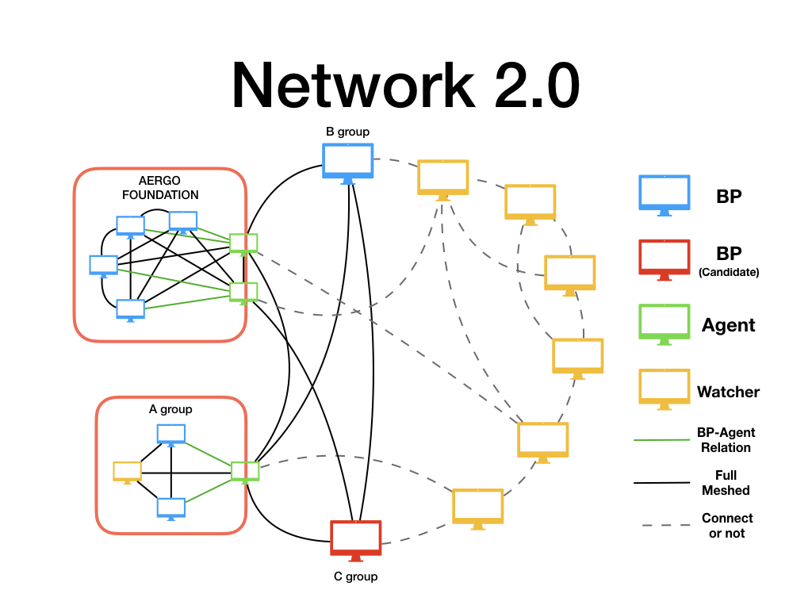

..  _aergonetwork2-label:

===========================
Configuring Aergo Network 2
===========================

Aergo Network 2.0 added a new node configuration concept to protect BP more securely and spread the produced blocks faster.

In the actual case of Aergo Network, the BP node is not directly exposed to the network, but is connected to the network through the Full node on the front. By doing so, BP can focus computing resources on block production. However, the connection between BPs in different region has a disadvantage of increasing propagation time as the intermediate delivery stage occurs. And, for example, communications in regions that are physically far away, such as Asia and South America, may take a lot of time just by simply delaying the network, so it may be difficult to meet the requirements for block production.

Agent actively discover other Agents or BPs in the public chain network to establish direct connections. The block produced by client BP is passed to the Agent and BP of the public network in a way that focuses on speed and delay time, and the new block notification from the Agent and BP of public network is passed to the client BP. On the other hand, the Watcher is informed in a way that focuses on data efficiency.

Each node uses BP information and voting results recorded in the chain to verify the qualifications of a legitimate BP, and the Agent checks the qualifications of the agent through certificates issued by a legitimate BP. It combines with PeerID-based identification, which is also applied to Aergo Network 1.0, to enable accurate identification and credentials.

Internal Zones
==============

There may be several BPs in one private network; these BPs can be connected directly to spread the blocks without having to pass through Agents. And these BPs can be more efficient in resource use by sharing Agents than by each BP having Agents.

For efficient use of network and computing resources, Agent categorizes networks to internal and external, delivering only internal to external, or vise versa.

The Agent node connects the client BPs in the internal network with other BPs or Agents in the external network.
The Agent passes blocks generated by a client to the BPs or Agents of the external network as quickly as possible, while the blocks notified by the external BPs or Agents are passed to the client BPs.

Configuration Example
=====================

NOTE: configuring BP and Agent are advanced topic, and wrong configuration can cause performance degradation or abnormal operation. So this configrations are more strictly checked than other settings; read the document carefully and set it up.

Suppose there is a foundation named Colchis, and the foundation decided to participate in the Aergo network.
The foundation establishes three BP nodes, one Agent node, and one node for TX registration and monitoring in the private network.
The private address and peer ID of each node are as follows.

.. code-block:: properties

	BP1    : 192.168.25.21 / 16Uiu2HAmH1Eup6qLSQg3Bk7B5QbrVPk6Bzw7upHhZ74ZTS8kM
	BP2    : 192.168.25.22 / 16Uiu2HAkzW5j6c6w9BhRnuudHuYc3Kqk4aNi4KbuoaYwVDx3HkS
	BP3    : 192.168.25.23 / 16Uiu2HAkvwrouZCrCSG8BqMM1v9GRj11jfjfjfhby5fAXgbCg
	Agent  : 192.168.25.31 / 16Uiu2HAm7P7quSBCxPHe89wNUYwCki1M8F45kMMRjw5M6bQdVWEv
	Watcher: 192.168.25.32 / 16Uiu2HAkvQYs1e6jVbpAeMfTNpDgUYhxry6gMRQnMAqymVL2Z45

The foundation registered the aergonode.colchis.org domain to join the chain network and forwarded the IP address of the domain to the agent machine.

BPs and Watcher allow access only from the Foundation's internal network and are linked to the public network only through Agent. 

The connection between Agent and client BP is built on the secured environment that the network manager cares about; BP and Agent must specify each other correctly in configuraion.

configuration for BP
--------------------

BP disables npexposeself, npdiscoverpeers, and npusepolaris settings so that they are not exposed to the outside and do not automatically connect to external nodes.
BP node also set agent field to peer id of agent node.

.. code-block:: toml

    # aergo TOML Configration File (https://github.com/toml-lang/toml)
    # base configurations
    datadir = "./data"
    enableprofile = false
    personal = false
        
    [p2p]
    npkey = "bp01.key"  # Name of key file of node
    npaddpeers = [
        "/ip4/192.168.25.22/tcp/7846/p2p/16Uiu2HAkzW5j6c6w9BhRnuudHuYc3Kqk4aNi4KbuoaYwVDx3HkS",
        "/ip4/192.168.25.23/tcp/7846/p2p/16Uiu2HAkvwrouZCrCSG8BqMM1v9GRj11jfjfjfhby5fAXgbCg",
        "/ip4/192.168.25.11/tcp/7846/p2p/16Uiu2HAm7P7quSBCxPHe89wNUYwCki1M8F45kMMRjw5M6bQdVWEv",
        "/ip4/192.168.25.12/tcp/7846/p2p/16Uiu2HAkvQYs1e6jVbpAeMfTNpDgUYhxry6gMRQnMAqymVL2Z45"
    ]
    npusepolaris = false
    npexposeself = false
    npdiscoverpeers = false # peer will not try to discover and connect other peers except for peers listed in npaddpeers
    peerrole = "producer"
    agent = "16Uiu2HAm7P7quSBCxPHe89wNUYwCki1M8F45kMMRjw5M6bQdVWEv"
    
    [blockchain]
    blockchainplaceholder = false
    coinbaseaccount = "[ADDRESS OF CONBASE ACCOUNT]"
    
    [mempool]
    showmetrics = true
    dumpfilepath = "./data/mempool.dump"
    
    [consensus]
    enablebp = true

configuration for Agent
-----------------------

Agent activates npexposeself, npdiscoverpeers, npusepolaris settings, and also sets addresses that can be accessed from the outside, so that they can connect to other nodes in the public network. Also set producers field to a list of the client BP's peer ids and internal zones.

.. code-block:: toml

    # aergo TOML Configration File (https://github.com/toml-lang/toml)
    # base configurations
    datadir = "./data"
    enableprofile = false
    personal = false
        
    [p2p]
    netprotocoladdr = "agent.colchis.org"
    npkey = "agent01.key"  # Name of key file of node
    npaddpeers = [
        "/ip4/192.168.25.21/tcp/7846/p2p/16Uiu2HAmH1Eup6qLSQg3Bk7B5QbrVPk6Bzw7upHhZ74ZTS8kM",
        "/ip4/192.168.25.22/tcp/7846/p2p/16Uiu2HAkzW5j6c6w9BhRnuudHuYc3Kqk4aNi4KbuoaYwVDx3HkS",
        "/ip4/192.168.25.23/tcp/7846/p2p/16Uiu2HAkvwrouZCrCSG8BqMM1v9GRj11jfjfjfhby5fAXgbCg",
        "/ip4/192.168.25.32/tcp/7846/p2p/16Uiu2HAkvQYs1e6jVbpAeMfTNpDgUYhxry6gMRQnMAqymVL2Z45"
    ]
    
    npexposeself = true  # peer is advertised by polaris or other peers
    npusepolaris = true
    peerrole = "agent"
    producers = [
        "16Uiu2HAmH1Eup6qLSQg3Bk7B5QbrVPk6Bzw7upHhZ74ZTS8kM",
        "16Uiu2HAkzW5j6c6w9BhRnuudHuYc3Kqk4aNi4KbuoaYwVDx3HkS",
        "16Uiu2HAkvwrouZCrCSG8BqMM1v9GRj11jfjfjfhby5fAXgbCg"
    ]
    internalzones = ["192.168.25.1/24"]
    
    [blockchain]
    
    [mempool]
    showmetrics = true
    dumpfilepath = "./data/mempool.dump"
    
    [consensus]
    enablebp = false

