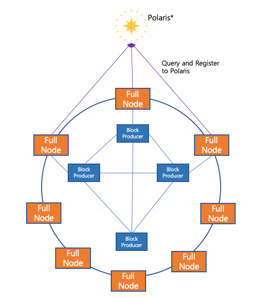

=======================
Tutorial - Custom Chain
=======================

개요
====

이 문서는 aergo 프로젝트로 사용자 전용 체인을 구축하는 방법을 소개한다.

노드 구성
---------

아래와 같은 형태의 노드 구성을 가정한다.

1. BP는 블록을 생성하며 자신의 담당 FullNode 와 신뢰할 수 있는 다른 BP와 연결된다.
2. FullNode는 다른 노드와 동기화를 수행하거나 API를 제공한다.
3. Polaris는 FullNode가 다른 노드의 정보를 받아와 접속할 수 있도록 노드 목록을 관리한다.
   

체인 구축 순서
==============

genesis용 json생성
^^^^^^^^^^^^^^^^^^

chainID와 최초 BP 목록 등을 저장한 genesis 파일을 만든다. 

TODO: 예제 파일 추가

genesis block 생성
^^^^^^^^^^^^^^^^^^

앞서 생성한 genesis 파일로부터 genesis block을 초기화한다.

