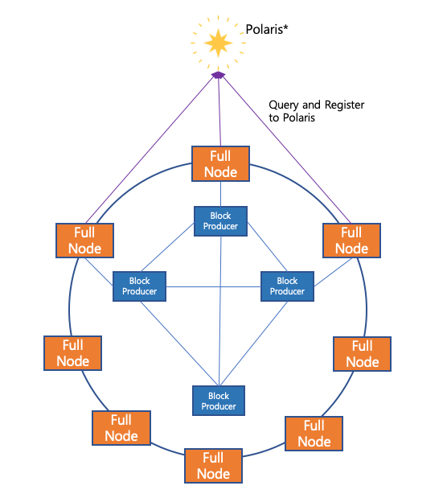

======================
Tutorial: Custom Chain
======================

This document describes how to build a user-specific chain with Aergo and Polaris.

Node configuration
==================

Assume the following node configuration.

1. BPs create blocks and associates them with its own full node and other trusted BPs.
2. A full node connects to responsible BPs and synchronizes with other nodes or provides API.
3. Polaris manages the node list so that full nodes can receive and connect to other nodes.

Chain build order
=================

Complete node configuration information
---------------------------------------
1. Polaris node: 1
2. BP nodes: 7. Each BP node is connected to two other BPs and internal full nodes
3. Full nodes: 2 

Preparing common files
----------------------

Create key files for all nodes
^^^^^^^^^^^^^^^^^^^^^^^^^^^^^^

Genesis block configuration
^^^^^^^^^^^^^^^^^^^^^^^^^^^
Create a genesis file containing the chainID and the initial BP list.

Example: mychain-genesis.json 

.. code-block:: json
	
	{
	    "chain_id":{
	        "magic": "mychain.net",
	        "public": false,
	        "mainnet": true,
	        "coinbasefee": "1000000000",
	        "consensus": "dpos"
	    },
	    "timestamp": 1545195494000000000,
	    "balance": {
	        "AmMK3LZiR1oEf66xzXir7mA5SUVVHSinWUYmh5FwueoVmciH3CuJ": "498700000000000000000000000",
	        "AmLsSfxo9aQRZJBvMBoLFb9QZABQK2RiG3Uq1JBhyAfbDYPf31J2": "100000000000000000000000",
	        "AmPJRLHDKtzLpsaC8ubmPuRkxnMCyBSq5wBwYNDD6DJdgiRhAhYR": "100000000000000000000000",
	        "AmNSmkDtwwSSrGHk4EP8yLP7YaC629fjnPg977JJfLpTe9zXtpsd": "100000000000000000000000",
	        "AmMR1CLHNnBCq7itY5XRX4LqLs5Ve1nZKxAcBRVZtwcsRdrytFqk": "100000000000000000000000",
	        "AmMvmu6HxRhYMjVgih4sXSYyDiM8HpuvZFnP9VHUtUd95qTUENR6": "100000000000000000000000",
	        "AmP5vYXeHBjGuvqDaGrZBoHyTHEJcUztUDvTam2HzqvA9jseqekd": "100000000000000000000000",
	        "AmNEfsKt1v2gosbu6eMg7fGBchkJzvEcmbG8A4EeMyusAU3M38mk": "100000000000000000000000",
	        "AmNJRh4ntQWT145jQwDHQGuHYdATmMWCEbENW2DN7mztfr5pqPbP": "100000000000000000000000",
	        "AmLvTAXSTVAs7tgASWnmZwgtyq7cLdtaoNqxrm11K91Jpc3XrHex": "100000000000000000000000",
	        "AmLqZFnwMLqLg5fMshgzmfvwBP8uiYGgfV3tBZAm36Tv7jFYcs4f": "100000000000000000000000",
	        "AmMLFNs1f5kFxxoG2Pq8wkFi5mJATQve7ZPPBZngHRjo2myU41k6": "100000000000000000000000",
	        "AmPxDZYmc7f6cTEzv8rTkbDxYtziTkRQEBbCW9r5GgVntpSmgXWb": "100000000000000000000000"
	    },
	    "bps": [
	        "16Uiu2HAmQn3nFBGhJM7TnZRguLhgUx1HnpNL2easdt2JrxdbFjtb",
	        "16Uiu2HAmAnQ5jjk7huhepfFtDFFCreuJ21nHYBApVpg8G7EBdwme",
	        "16Uiu2HAkvbHmK1Ke1hqAHmahwTGE4ndkdMdXJeXFE3kgBs17k2oQ",
	        "16Uiu2HAkw9ZZ61iq8uWbrQrmNEXFbrbkWupdqiHSKkCuCFLTM6gF",
	        "16Uiu2HAmUkoPDPHrYYC8J4sVvaVRho8UxfWPLDgZS8gu5bsGSRSA",
	        "16Uiu2HAmNxKsrFQ4Wez4DYHW6o72y2Jpy6RMv5TuqAvjcQ5QPZWw",
	        "16Uiu2HAmDFV41vku39rsMtXBaFT1MFUDyHxXiDJrUDt7gJycSKnX"
	    ]
	}

Genesis block generation
^^^^^^^^^^^^^^^^^^^^^^^^
Repeat this operation for each node. Initialize the genesis block by copying the generated genesis file to the node.

::

	aergosvr init mychain-genesis.json --dir data

As a result, genesis blocks and basic data files are created in the data directory.

Setup Polaris
-------------
Copy the generated genesis file to the polaris node.

Polaris configuration file
^^^^^^^^^^^^^^^^^^^^^^^^^^
Install key and genesis file, and configure it according to whether it is a private chain inside / public chain.

Exampke: mychain-polaris.toml
::

	[rpc]
	netserviceaddr = "127.0.0.1"
	netserviceport = 9915

	[p2p]
	netprotocoladdr = "192.168.0.2"
	netprotocolport = 8915
	npbindaddr = ""
	npkey = "mychain-polaris.key"

	[polaris]
	allowprivate = true
	genesisfile = "mychain-genesis.json"

Running the Polaris Server
^^^^^^^^^^^^^^^^^^^^^^^^^^
::

	./polaris --config mychain-polaris.toml

Setup aergosvr
--------------

aergosvr configuration file
^^^^^^^^^^^^^^^^^^^^^^^^^^^

Example: mychain-bp01.toml
::

	# aergo TOML Configration File (https://github.com/toml-lang/toml)
	# base configurations
	datadir = "/blockchain/aergo/data"
	dbtype = "badgerdb"
	enableprofile = false

	[rpc]
	netserviceaddr = "127.0.0.1"
	netserviceport = 7845
	netservicetrace = false

	[p2p]
	netprotocoladdr = "192.168.0.11"
	netprotocolport = 7846
	# Set file path of key file
	npkey = "/blockchain/aergo/auth/mychain-bp01.key"
	npusepolaris= true
	npaddpolarises = [
	    "/ip4/192.168.0.2/tcp/8915/p2p/16Uiu2HAmJCmxe7CrgTbJBgzyG8rx5Z5vybXPWQHHGQ7aRJfBsoFs"
	]

Running aergosvr
^^^^^^^^^^^^^^^^
::

	./aergosvr --config mychain-bp01.toml

